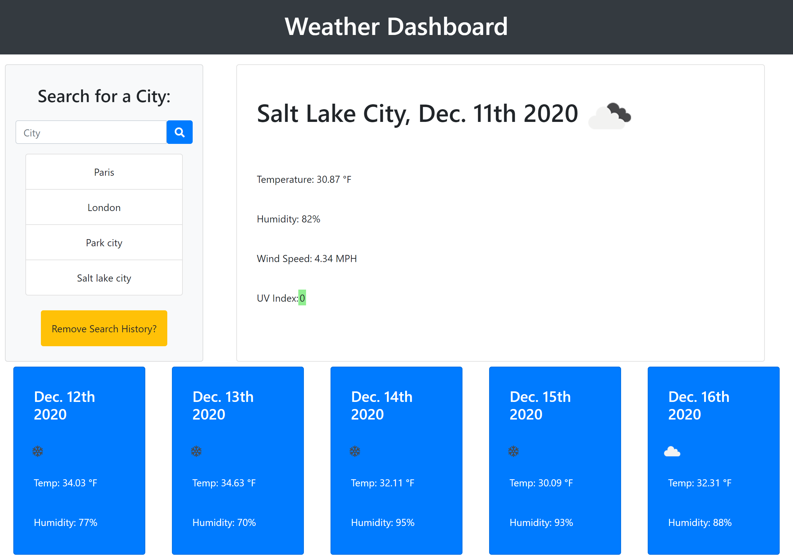

# Mitchell Heyn's Weather Dashboard

## Purpose

An online dashboard where a client can search for a city and can see what the current weather looks like with certain data points and can see a 5-day forecast for the selected city.

## Built With

- HTML
- CSS (Bootstrap)
- JavaScript (jQuery)

## Website

https://mheyn95.github.io/weather-dashboard/

## Screenshot

